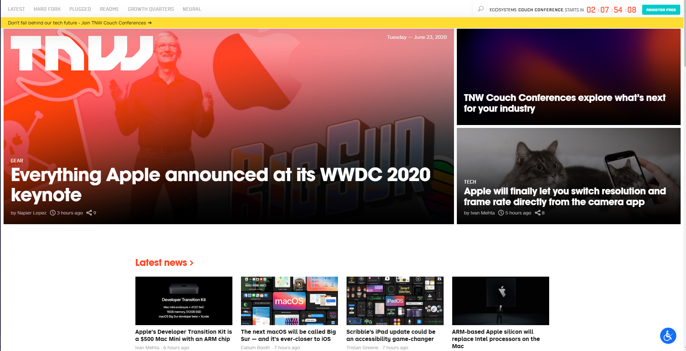
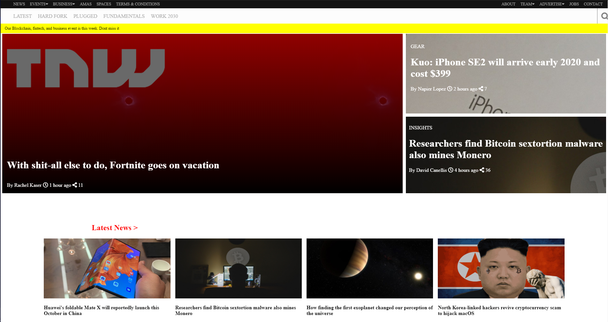

# BUILDING WITH RESPONSIVE DESIGN

## [Collaborative Project]

~ This project consists of building a responsive website. We cloned [The Next Web](https://thenextweb.com/), a tech-focused magazine which uses media queries to gracefully degrade their site as the window size is reduced.

You can find the original project specification [here](https://www.theodinproject.com/courses/html5-and-css3/lessons/building-with-responsive-design)

|Source Page|The cloned page screenshot|
|:---:|:---:|
|||

## Tools Used

- HTML
- CSS
- Media Queries
- Flex & Grids
- FontAwsome v5.11.2
- MarkDown Syntax

## Work Done

- [x] Create header Section
- [x] Create top-header
- [x] Create blockchain Section
- [x] Crete upcoming and news-section Sections
- [x] Create companies Section
- [x] Create post-news Section
- [x] Create bottom-header Section
- [x] Create bottom-updates Section
- [x] Create footer Section
- [x] Create media-queries for responsiveness
- [x] Use Semantic HTML
- [x] Use Flex and Grids
- [x] Check CSS with stylelint
- [x] Check html with W3C validator
- [x] Validate Readme file with markdown lint

## How to Install and use

- clone the repository `git clone https://github.com/RoodzFernando/building-with-responsive-design.git`
- open command prompt in `building-with-responsive-design` folder
- run the application using open live server functionality.

<<<<<<< HEAD
LInk to live demo [here](https://roodzfernando.github.io/building-with-responsive-design/)
=======
LInk to live demo [here](https://RoodzFernando.github.io/building-with-responsive-design/.)

## Authors social links

### 1. Roodz Fernando

- Github: [@RoodzFernando](https://github.com/RoodzFernando)
- Twitter: [@RoodzFernando](https://twitter.com/RoodzFernando)
- Linkedin: [Roodz Fernando](https://www.linkedin.com/in/roodz-fernando-fleurant/)

### 2. Christian Otieno

- Github: [@christianotieno](https://github.com/christianotieno)
- Twitter: [@iamchrisotieno](https://twitter.com/iamchrisotieno)
- Linkedin: [Christian Otieno](https://www.linkedin.com/in/christianotieno/)
>>>>>>> design-branch
